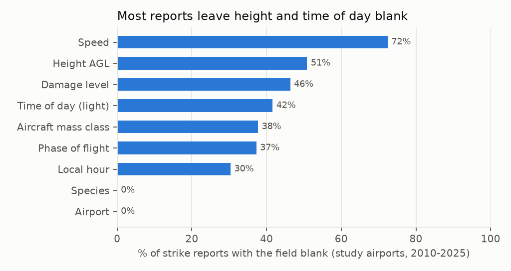
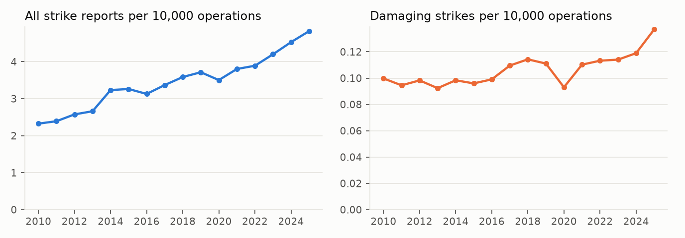
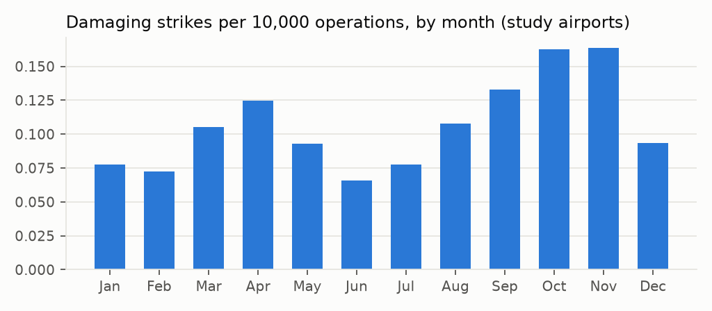

# Week 1 - Data quality report

_Generated by `src/bird_strike_radar/report_week1.py`. Re-run the pipeline to refresh._

## Headline numbers

- Raw strike reports in the FAA export: **356,844** (1990 to 2026).
- Study window 2010-2025: **242,449** reports. Years after 2025 (2026) are excluded
  because they are still filling in with late reports.
- Study airports: **266** of 530 towered airports
  (scheduled service, median commercial ops >= 5,000/yr, >= 8 years of tower data).
- Reports at study airports: **178,004** (73% of the window), of which
  **5,513** are damaging (M, M?, S or D).
- Reports with **unknown** damage level in the window: **40%**. These are treated as missing,
  not as "no damage".

## Decisions made this week

| Decision | Choice | Why |
|---|---|---|
| Outcome | "Damaging strike" = damage level M, M?, S or D | Damaging strikes are reported far more completely than harmless ones, so the reporting bias is smallest here. |
| Unknown damage | Kept as missing (`<NA>`) | The FAA's own `INDICATED_DAMAGE` flag codes blanks as 0; treating them as "no damage" would silently lower every rate. |
| Dates | Year/month from `INCIDENT_YEAR`/`INCIDENT_MONTH`; day from `INCIDENT_DATE` | `INCIDENT_DATE` uses a two-digit year. |
| Airport ids | ICAO in strikes, FAA LID in ATADS, joined through OurAirports | Renamed airports (e.g. PBI) matched through the `K`+LID fallback. |
| Study airports | Rule above; strike counts never used to select | Selecting on the outcome would bias every downstream rate. |
| Altitude bands | ground / 0-500 / 500-3,000 / above 3,000 ft AGL | Separates runway, initial climb/short final, traffic pattern, above pattern. |
| Personal data | Reporter names/titles, remarks, comments, tail and flight numbers dropped at load | Never needed; never written to `data/processed/`. |
| Coordinates | From OurAirports | `AIRPORT_LATITUDE`/`LONGITUDE` are empty in this export. |

## Key finding: "unknown damage" mostly means "no aircraft identified"

79% of reports with a blank damage level also have no identified operator. These are
mostly carcasses found on or near the runway, where nobody knows which aircraft hit the bird, so nobody
can say whether it was damaged. Two consequences:

- They still count as strikes (useful for the "all strikes" layer), but they can't inform the damage model.
- Damaging reports are much more complete than the rest (see the last column below). Whoever files a
  damaging report fills in the form; carcass reports leave most of it blank. So missingness is **not
  random**, and conditional shares (e.g. "what fraction of damaging strikes happen above 500 ft")
  must be computed from damaging reports only, never from all reports.

## Missing fields

| Field | Missing (all strikes) | Missing (study airports) | Missing (damaging, study) |
|---|---|---|---|
| Airport | 14% | 0% | 0% |
| Damage level | 40% | 46% | n/a |
| Time of day (light) | 47% | 42% | 6% |
| Local hour | 34% | 30% | 8% |
| Height AGL | 56% | 51% | 18% |
| Phase of flight | 44% | 37% | 0% |
| Species | 0% | 0% | 0% |
| Aircraft mass class | 32% | 38% | 0% |
| Speed | 74% | 72% | 42% |

**What this means for the model:** height and time of day are blank in a large share of reports,
so the altitude-band and time-of-day breakdowns will be estimated from the subset that has them,
and the uncertainty shown on the map has to reflect that. Check whether missingness is itself related to
damage (the third column) before assuming it is random.

## Damage level mix (study airports, 2010-2025)

| Damage level | Reports | Share |
|---|---|---|
| N - none | 89,998 | 50.6% |
| M - minor | 1,492 | 0.8% |
| M? - damaged, extent unknown | 3,359 | 1.9% |
| S - substantial | 660 | 0.4% |
| D - destroyed | 2 | 0.0% |
| (blank) - unknown | 82,493 | 46.3% |

## Rates over time

All reports per operation rise much faster than damaging strikes per operation. That gap is the
**reporting-behaviour trend** the model needs a year term for: more harmless strikes are being reported,
not necessarily more strikes happening. 2020-21 traffic is distorted by COVID.

## Seasonality

The late-summer / autumn peak is the migration signal the time slider will animate.

## Airports with the most reports

| Airport | Name | Reports | Damaging | damaging per 10k ops (median yr) |
|---|---|---|---|---|
| KDEN | Denver International Airport | 8700 | 145 | 0.15 |
| KDFW | Dallas Fort Worth International Airport | 6197 | 125 | 0.12 |
| KORD | Chicago O'Hare International Airport | 4814 | 104 | 0.07 |
| KMEM | Frederick W. Smith International Airport | 3736 | 82 | 0.23 |
| KJFK | John F. Kennedy International Airport | 3645 | 150 | 0.21 |
| KATL | Hartsfield Jackson Atlanta International Airport | 3545 | 87 | 0.06 |
| KDTW | Detroit Metropolitan Wayne County Airport | 3377 | 49 | 0.08 |
| KSLC | Salt Lake City International Airport | 3161 | 198 | 0.38 |
| KIAH | George Bush Intercontinental Airport | 3141 | 59 | 0.08 |
| KMCO | Orlando International Airport | 3015 | 168 | 0.33 |

Raw report counts mostly track traffic volume and reporting culture. That's why the map will offer
"raw reports" vs "estimated true risk" rather than showing counts alone.

## Open questions for Week 2

1. Denominator for the damage model: known-damage reports only, or all reports with an imputation for unknowns?
2. How much of the reporting trend differs by airport (e.g. airports with a staff wildlife biologist)?
3. Do we need an aircraft-mass split, since larger aircraft report differently and take different damage?
