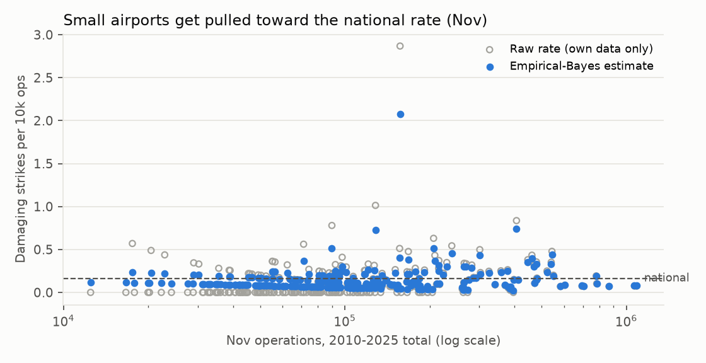
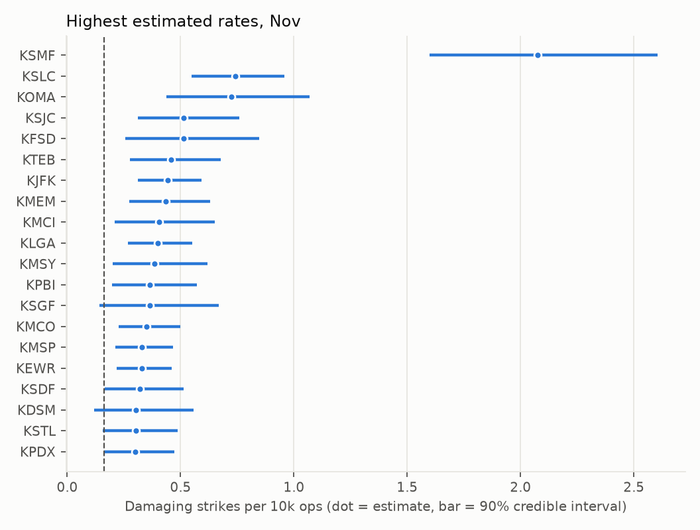
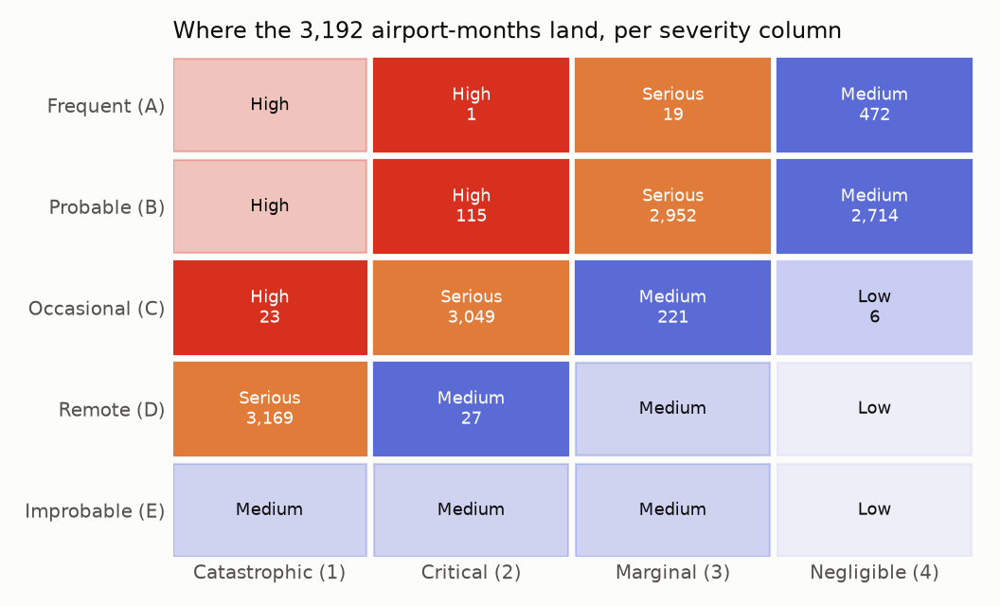

# Week 2 - Baseline rates and MIL-STD-882E risk

_Generated by `src/bird_strike_radar/report_week2.py`._

## What was built

1. **Empirical-Bayes rate model** (`baseline.py`). For each calendar month, a Gamma prior describing
   "a typical study airport" is fitted from all 266 airports, then each airport's damaging-strike
   rate per 10,000 operations is updated with its own data. Output: estimate + 89% credible interval
   for 3,192 airport-months.
2. **Severity mapping** (`severity.py`). FAA outcomes -> MIL-STD-882E Table I categories using the table's own
   dollar bands (inflation-adjusted repair + other costs), injuries and fatalities.
3. **882E risk logic** (`mil882.py`). Tables I-III transcribed from the standard and unit-tested cell by cell.
   Probability levels use the Appendix A (Table A-II) example thresholds, unmodified.

## Decisions

| Decision | Choice | Why |
|---|---|---|
| Numerator (Option A) | Known damaging strikes only | Unknown-damage reports are mostly carcass finds; including them needs an unverifiable imputation. Rates are a slight, documented underestimate. |
| Exposure unit | 10,000 operations | 882E requires the denominator to be defined. A fixed number of operations compares airports fairly regardless of size (~1 month at the median study airport). |
| Probability thresholds | Table A-II as published | Tailoring the bins to spread the map would be fitting the ruler to the data. |
| Overall risk | Worst risk across the four severity columns | A hazard with several credible outcomes is assessed at each; the worst governs. |
| Map colour | Estimated rate relative to national, same month | The 882E category barely varies (see below); the continuous rate is where airports differ. |
| Unknown severity | Distributed using P(severity given damage level) from reports with known cost | Only ~21% of damaging reports have a cost or injury recorded. |

## Severity mix of damaging strikes

| 882E severity | Share of damaging strikes | Reports with this severity known |
|---|---|---|
| Catastrophic (1) | 0.26% | 2 |
| Critical (2) | 4.31% | 67 |
| Marginal (3) | 25.33% | 287 |
| Negligible (4) | 70.11% | 776 |

Evidence behind it:

| FAA damage level | Damaging reports | Severity determinable (cost/injury known) |
|---|---|---|
| M | 1,492 | 24% |
| M? | 3,359 | 15% |
| S | 660 | 40% |
| D | 2 | 100% |

**Caveat:** costs are probably recorded more often for expensive events, which would make this mix lean severe.
The Catastrophic share rests on very few cases and a weak prior, so treat it as "credible but rare",
which is also how 882E treats it.

## Shrinkage

Hollow grey = each airport's raw rate; blue = the estimate after partial pooling. Airports with little traffic
get pulled strongly toward the national line; high-traffic airports keep most of their own signal.

Only **8%** of airport-months have a 90% interval entirely above or below the national rate.
Most month-to-month airport differences on the map are **within the noise**, and the interface has to say so.

## Where airports land on the risk matrix

| Overall risk | Airport-months |
|---|---|
| High | 116 |
| Serious | 3,076 |
| Medium | 0 |
| Low | 0 |

**Key finding:** under the unmodified standard, almost every commercial airport-month is **Serious**.
The Catastrophic column alone guarantees it: Catastrophic x Remote is Serious, and "Remote" spans three
orders of magnitude (10^-3 to 10^-6). Airports reach **High** only when $1M+ (Critical) strikes become
Probable per 10k operations. 31% of airport-months could be in a different overall
risk level at the ends of their credible interval.

This is the standard working as intended, since every airport carries a rare but credible catastrophic
outcome, and it's why the map colours by the continuous rate while the matrix shows the categorical assessment.

### Worked example: KSMF, Dec (highest estimated rate)

Damaging rate estimate 2.49 per 10k ops (90% CI 1.98-3.06),
26.8x the national Dec rate.

| Severity | P(>=1 in 10k ops) | Level | Risk |
|---|---|---|---|
| Catastrophic | 6.39e-03 | Occasional (C) | High |
| Critical | 1.02e-01 | Frequent (A) | High |
| Marginal | 4.68e-01 | Frequent (A) | Serious |
| Negligible | 8.26e-01 | Frequent (A) | Medium |

Overall: **High**.

## Airports with the highest annual damaging rates

| Airport | Raw annual damaging / 10k ops | Peak month | Peak estimate | Months rated High |
|---|---|---|---|---|
| KSMF | 1.125 | Dec | 2.494 | 8 |
| KHTS | 0.408 | Nov | 0.235 | 1 |
| KSLC | 0.376 | Nov | 0.741 | 5 |
| KRSW | 0.33 | Aug | 0.418 | 3 |
| KMCO | 0.312 | Oct | 0.358 | 9 |
| KSDF | 0.303 | Sep | 0.452 | 4 |
| KMCI | 0.298 | Nov | 0.405 | 4 |
| KOMA | 0.283 | Nov | 0.723 | 4 |
| KPIA | 0.276 | Dec | 0.305 | 1 |
| KFSD | 0.273 | Nov | 0.514 | 3 |

Raw annual rates are unshrunk, so small airports (e.g. a single bad year at a regional airport) can rank high
here but not on the map. KSMF stands out on every measure. Whether that's more hazard (Central Valley
waterfowl in winter) or more thorough reporting is exactly the question the Week 4 model and the
"raw vs estimated" toggle have to be honest about: **from strike reports alone, the two can't be fully separated.**

## Next

- Week 3: the minimum map (React + MapLibre on GitHub Pages) reading an exported JSON of this table.
- Week 4: replace per-month independent priors with the hierarchical model (airport, region x month, year trend).
- Data note: 2 damaging strikes fell in months with no tower count and were excluded.
