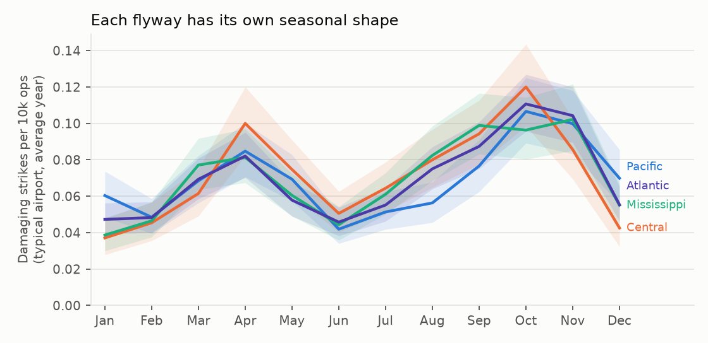
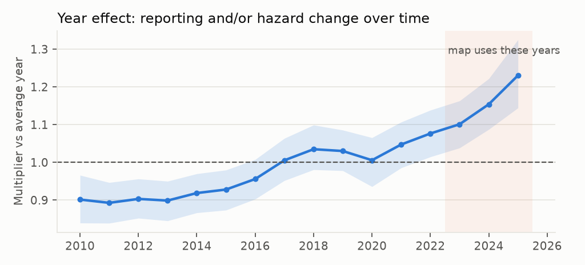
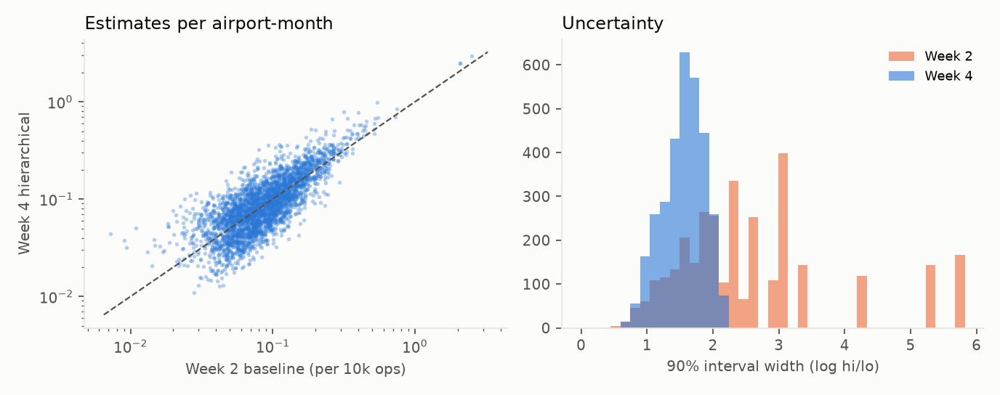

# Week 4 - Bayesian hierarchical model

_Generated by `src/bird_strike_radar/report_week4.py`._

## The model in one paragraph

All 266 airports, 12 months and 16 years are fitted together. Each airport-month-year's damaging-strike
count is negative-binomial around (rate x traffic). The log rate is the sum of: a national level, national
seasonality, a **flyway-specific seasonal shape**, an airport level, the airport's own seasonal quirks,
a **national year effect** (random walk) and an **airport-specific trend**. Every group of effects has a learned
spread, so sparse airports borrow strength from their flyway and the nation. The map shows rates at current
conditions, i.e. the year effect averaged over 2023-2025.

## Did the sampler work?

All checks pass. Divergences: **0**,
worst R-hat: **1.007** (want < 1.01), smallest effective sample size: **253**.

| Parameter | Posterior mean | R-hat | Effective samples |
|---|---|---|---|
| b0 | -2.71 | 1.002 | 253 |
| s_season | 0.34 | 1.002 | 525 |
| s_flyseason | 0.175 | 1.001 | 531 |
| s_airport | 0.69 | 1.007 | 264 |
| s_aseason | 0.37 | 1.002 | 564 |
| s_year | 0.0558 | 0.999 | 925 |
| s_trend | 0.0858 | 0.999 | 431 |
| phi | 12.6 | 1.000 | 1391 |

## Does the model reproduce the data? (posterior predictive check)

| Statistic | Observed | Model's 90% range | Consistent? |
|---|---|---|---|
| Share of airport-months with zero damaging strikes | 91.2% | 90.9%-91.4% | yes |
| Largest single airport-month count | 10 | 6-10 | yes |
| Total damaging strikes | 5,511 | 5,294-5,699 | yes |
| Variance / mean (clumpiness) | 1.40 | 1.34-1.45 | yes |

## What the model learned

The year effect is the clearest sign of changing reporting: if the hazard itself were stable, this curve
would be flat. The map uses the 2023-2025 level, so it describes recent conditions
rather than a 16-year average.

## Compared with the Week 2 baseline

- Median ratio Week 4 / Week 2: **1.03** (estimates move up toward current, higher-reporting conditions).
- Airport-months whose 882E overall risk changed: **5%**.
- Airport-months clearly above or below national: **33%** (Week 2: 8%). The Week 2 baseline
  fitted each month separately; this model shares each airport's information across all 12 months and 16 years,
  so its intervals are much narrower. The simulation check shows that narrowing is earned: coverage stays near 90%.
- The simulation check (`week4_simulation_check.md`) shows the hierarchical model recovers planted truth with
  about 90% interval coverage and lower error than the baseline.

## Most clearly elevated airport-months

| Airport | Peak month | x national | 90% lo | 90% hi | P(above national) |
|---|---|---|---|---|---|
| KSMF | Dec | 28.03 | 21.12 | 35.51 | 1.0 |
| KRSW | Aug | 4.68 | 2.5 | 7.68 | 1.0 |
| KSLC | Nov | 4.61 | 3.31 | 6.17 | 1.0 |
| KMCO | Jun | 4.17 | 2.71 | 5.88 | 1.0 |
| KSDF | Sep | 4.16 | 2.61 | 6.07 | 1.0 |
| KOMA | Nov | 3.81 | 2.19 | 5.79 | 1.0 |
| KCMH | Aug | 3.79 | 2.15 | 6.02 | 1.0 |
| KMCI | Mar | 3.77 | 2.15 | 5.95 | 1.0 |
| KPIE | Jun | 3.71 | 1.95 | 6.05 | 1.0 |
| KSAT | Jun | 3.41 | 1.85 | 5.51 | 1.0 |

## Limitations carried forward

- Reporting and hazard still can't be fully separated. The airport-specific trend absorbs airports whose
  reporting changed, but an airport that has always reported thoroughly still looks riskier.
- Flyway assignment by state (with a longitude split for MT/WY/CO/NM) is approximate.
- Real-world accuracy is not tested here; that's Week 5 (fit 2010-2022, predict 2023-2025).
