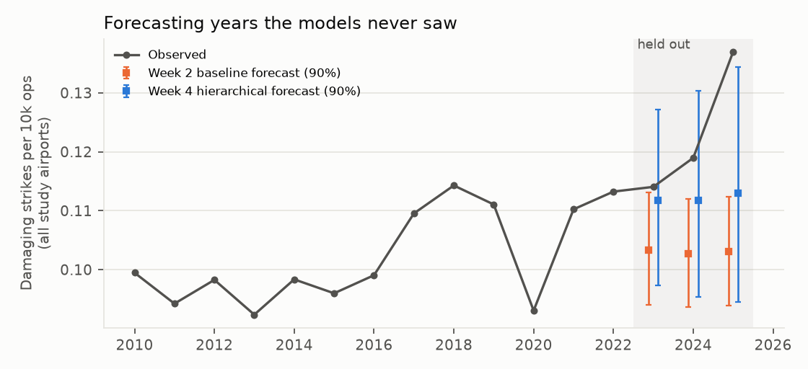
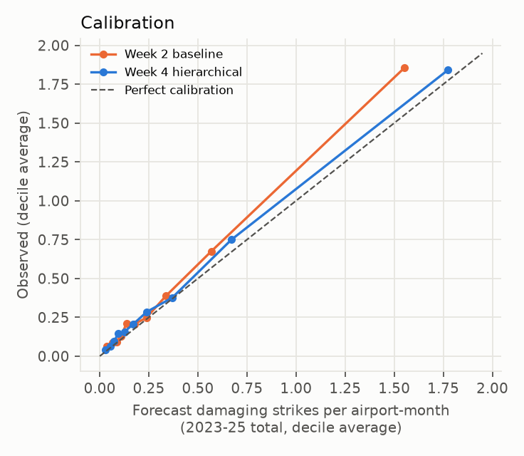
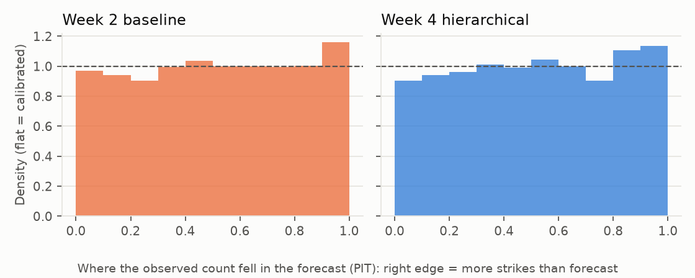

# Week 5 - Does the model predict years it hasn't seen?

_Generated by `src/bird_strike_radar/report_week5.py`._

## The test

Every model was fitted on **2010-2022 only**, then asked to forecast damaging strikes at each
study airport, in each month, for **2023-2025** (9,557 airport-year-months; 1,264 damaging
strikes actually happened). Traffic in the test years is treated as known (a planner knows the schedule);
strikes are what is forecast. The hierarchical model was refitted from scratch on the training years
(0 divergences), and its year random walk and airport trends were extended into the
future with their own uncertainty.

## Scorecard

| Model | Log score vs national (per 1,000 cells) | 90% range covers (81 busiest airport-months) | Below 5% / above 95% | Forecast total (90%) | Covers observed? | Top-10% lift |
|---|---|---|---|---|---|---|
| National monthly rate | +0.0 | 93% | 4.1% / 7.1% | 1,052 (998-1,107) | **no** | 1.33x |
| Raw (own data only) | impossible (213 airport-months given 0% chance) | 94% | 4.3% / 11.8% | 1,058 (1,007-1,111) | **no** | 2.48x |
| Week 2 baseline | +24.5 | 87% | 4.8% / 6.6% | 1,055 (1,000-1,110) | **no** | 2.17x |
| Week 2 + recent level | +25.2 | 88% | 4.4% / 5.9% | 1,098 (1,042-1,154) | **no** | 2.18x |
| Week 4 hierarchical | +30.8 | 96% | 4.5% / 5.7% | 1,149 (1,012-1,313) | yes | 2.31x |

How to read it:
- **Log score** is the main score: the average log-probability each model gave to what actually happened.
  It rewards being right *and* being honest about uncertainty. Shown as the gain over the national-rate
  model per 1,000 airport-year-months; higher is better.
- **Coverage** is checked on the airport-months expecting 2+ strikes. Most airport-months expect 0-1, where any
  sensible range covers almost everything, so the all-cell number (98% for Week 4) says little.
- **Below 5% / above 95%** should each be about 5% if the forecasts are calibrated.
- **Top-10% lift**: in the 10% of airport-months each model ranked riskiest, how many times the average
  rate actually occurred.

## What it means

- **The hierarchical model wins on the main score.** It beats the Week 2 baseline in a cell-by-cell comparison
  by 6.3 ± 1.4 per 1,000 cells (about 5 standard errors). Of the gain from knowing
  *which airport* you're at (beyond the national rate), Week 4 captures 1.26x what Week 2 does.
- **Most of the advantage is not the trend.** Giving Week 2 a crude "recent level" fix recovers only 12% of the gap; the rest comes from the structure (flyway seasons, airport seasonality, airport trends).
- **The volume forecast is honest.** 1,264 damaging strikes happened. Week 4 forecast
  1,149 (1,012-1,313), which contains the truth; Week 2 forecast
  1,055 (1,000-1,110) and is confidently wrong. Week 2 assumes the future
  looks like the 13-year average; Week 4 carries recent reporting growth forward and admits it can't
  know next year's level precisely. One caveat: the observed national rate in 2025 came in above Week 4's 90% range for that year. The national rate (reporting, hazard or both) jumped faster than the random walk expected, and that is the main reason most of the failure cases below are under-forecasts.
- **Raw rates fail outright.** An airport-month with no damaging strikes in training gets a raw rate of zero,
  i.e. "impossible", and 213 of those then had a strike. That is the clearest argument for pooling.
- **Ranking is modest for every model.** A 3-year window is short and damaging strikes are rare, so observed
  airport-month rates are noisy. Still, the 10% of airport-months Week 4 ranked riskiest saw
  2.3x the average rate. Raw rates rank slightly better (2.5x) but would have
  called 213 airport-months impossible that then had strikes: good at ranking, dangerous as a forecast.

## Failure cases

191 held-out airport-months fell in Week 4's outer 2.5% tails (about 160 expected by chance with
perfect calibration); 110 of them were under-forecasts. The biggest surprises:

| Airport | Month | Forecast (90%) | Observed 2023-25 | Direction |
|---|---|---|---|---|
| KMCO | Jun | 3.7 (1-8) | 0 | over-forecast |
| KLRD | Jul | 0.035 (0-0) | 3 | under-forecast |
| KLBB | Oct | 0.25 (0-1) | 4 | under-forecast |
| KECP | Jul | 0.11 (0-1) | 3 | under-forecast |
| KCID | Mar | 0.15 (0-1) | 3 | under-forecast |
| KATL | Apr | 2.1 (0-5) | 0 | over-forecast |
| KIWA | Jul | 0.42 (0-2) | 4 | under-forecast |
| KSMX | Jan | 0.034 (0-0) | 2 | under-forecast |
| KLRD | Mar | 0.038 (0-0) | 2 | under-forecast |
| KCWA | Apr | 0.047 (0-0) | 2 | under-forecast |

These are where the tool would have misled a user. The usual causes are a one-off cluster (a single flock
producing several damaging strikes), a change in an airport's reporting, or a genuine change in its wildlife
situation. Strike data alone can't tell these apart; checking the narratives for these cases is a manual next step.

## Limitations of this evaluation

- Study airports were chosen using traffic from all years, including 2023-2025. That uses exposure only,
  never strike counts, so it doesn't leak the outcome, but it does assume each airport is still operating.
- Test traffic is treated as known. A real forecast would also be uncertain about operations.
- Three test years is a single, short window, and it starts right after the COVID traffic dip.
- Good forecasts of *reported* damaging strikes are not proof of good forecasts of *hazard*: if reporting
  keeps changing, a model can predict reports well while hazard moves differently.
